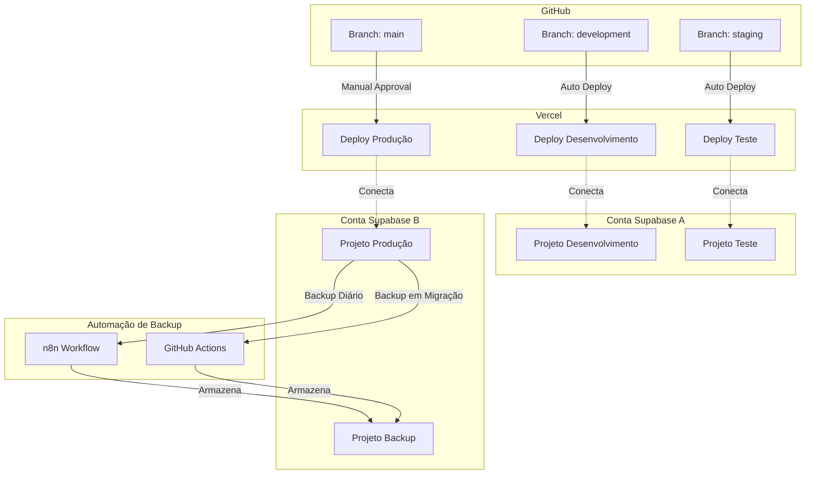
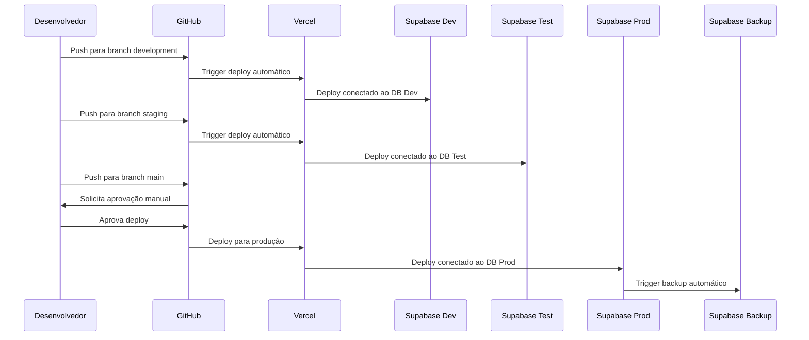
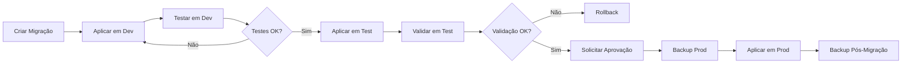

# Documento de Design

## Visão Geral

Este documento descreve o design técnico para implementar uma arquitetura multi-ambiente utilizando duas contas gratuitas do Supabase, Vercel para hospedagem, Git/GitHub para versionamento, e automação de backup via n8n ou GitHub Actions. A solução garante isolamento completo entre ambientes, segurança dos dados de produção, e estratégia robusta de backup.

### Contexto e Restrições

**Restrições do Plano Gratuito Supabase:**
- Máximo de 2 projetos por conta
- Sem suporte a branches de desenvolvimento
- Sem backups automáticos nativos
- Limite de 500MB de armazenamento por projeto
- Limite de 2GB de largura de banda por mês
- Pausa automática após 7 dias de inatividade

**Estratégia de Contas:**
- **Conta Supabase A**: Desenvolvimento + Teste
- **Conta Supabase B**: Produção + Backup

## Arquitetura

### Diagrama de Arquitetura Geral



### Fluxo de Trabalho de Desenvolvimento



## Componentes e Interfaces

### 1. Gerenciador de Configuração de Ambientes

**Responsabilidade:** Gerenciar variáveis de ambiente e configurações específicas por ambiente.

**Estrutura de Arquivos:**

```
/config
  ├── .env.development       # Variáveis para desenvolvimento
  ├── .env.test             # Variáveis para teste
  ├── .env.production       # Variáveis para produção (não commitado)
  ├── .env.example          # Template de variáveis
  └── environment.config.ts # Validador e carregador de configs
```

**Variáveis de Ambiente por Ambiente:**

```typescript
// Desenvolvimento (Conta Supabase A - Projeto 1)
NEXT_PUBLIC_SUPABASE_URL=https://dev-project.supabase.co
NEXT_PUBLIC_SUPABASE_ANON_KEY=eyJ...dev
SUPABASE_SERVICE_ROLE_KEY=eyJ...dev-service

// Teste (Conta Supabase A - Projeto 2)
NEXT_PUBLIC_SUPABASE_URL=https://test-project.supabase.co
NEXT_PUBLIC_SUPABASE_ANON_KEY=eyJ...test
SUPABASE_SERVICE_ROLE_KEY=eyJ...test-service

// Produção (Conta Supabase B - Projeto 1)
NEXT_PUBLIC_SUPABASE_URL=https://prod-project.supabase.co
NEXT_PUBLIC_SUPABASE_ANON_KEY=eyJ...prod
SUPABASE_SERVICE_ROLE_KEY=eyJ...prod-service

// Backup (Conta Supabase B - Projeto 2)
BACKUP_SUPABASE_URL=https://backup-project.supabase.co
BACKUP_SUPABASE_SERVICE_KEY=eyJ...backup-service
```

**Interface do Gerenciador:**

```typescript
interface EnvironmentConfig {
  supabaseUrl: string;
  supabaseAnonKey: string;
  supabaseServiceKey?: string;
  environment: 'development' | 'test' | 'production';
  backupConfig?: BackupConfig;
}

interface BackupConfig {
  backupUrl: string;
  backupServiceKey: string;
  retentionDays: number;
}
```


### 2. Sistema de Migração de Banco de Dados

**Responsabilidade:** Gerenciar e aplicar migrações de schema de forma controlada entre ambientes.

**Estrutura de Diretórios:**

```
/supabase
  ├── migrations/
  │   ├── 20240101000000_initial_schema.sql
  │   ├── 20240102000000_add_users_table.sql
  │   └── 20240103000000_add_posts_table.sql
  ├── seed/
  │   ├── development.sql
  │   └── test.sql
  └── config.toml
```

**Fluxo de Migração:**



**Scripts de Migração:**

```bash
# Aplicar migração em ambiente específico
npm run migrate:dev    # Aplica em desenvolvimento
npm run migrate:test   # Aplica em teste
npm run migrate:prod   # Aplica em produção (requer aprovação)

# Rollback de migração
npm run migrate:rollback:dev
npm run migrate:rollback:test
```


### 3. Sistema de Automação de Backup

**Responsabilidade:** Realizar backups automáticos do banco de produção para o projeto de backup.

**Opção 1: GitHub Actions (Recomendado para simplicidade)**

```yaml
# .github/workflows/backup-production.yml
name: Backup Produção

on:
  schedule:
    - cron: '0 2 * * *'  # Diariamente às 2h AM
  workflow_dispatch:      # Permite execução manual
  repository_dispatch:    # Trigger via webhook após migração
    types: [migration-completed]

jobs:
  backup:
    runs-on: ubuntu-latest
    steps:
      - name: Checkout
        uses: actions/checkout@v3
      
      - name: Setup PostgreSQL Client
        run: sudo apt-get install postgresql-client
      
      - name: Backup Database
        env:
          PROD_DB_URL: ${{ secrets.PROD_SUPABASE_DB_URL }}
          BACKUP_DB_URL: ${{ secrets.BACKUP_SUPABASE_DB_URL }}
        run: |
          TIMESTAMP=$(date +%Y%m%d_%H%M%S)
          pg_dump $PROD_DB_URL > backup_$TIMESTAMP.sql
          psql $BACKUP_DB_URL < backup_$TIMESTAMP.sql
      
      - name: Verify Backup
        run: |
          # Script de verificação de integridade
          
      - name: Cleanup Old Backups
        run: |
          # Remove backups com mais de 30 dias
      
      - name: Notify on Failure
        if: failure()
        uses: actions/github-script@v6
        with:
          script: |
            // Enviar notificação de falha
```


**Opção 2: n8n Workflow**

```json
{
  "nodes": [
    {
      "name": "Schedule Trigger",
      "type": "n8n-nodes-base.scheduleTrigger",
      "parameters": {
        "rule": {
          "interval": [{ "field": "hours", "hoursInterval": 24 }]
        }
      }
    },
    {
      "name": "Webhook Trigger",
      "type": "n8n-nodes-base.webhook",
      "parameters": {
        "path": "backup-trigger"
      }
    },
    {
      "name": "Export Production DB",
      "type": "n8n-nodes-base.postgres",
      "parameters": {
        "operation": "executeQuery",
        "query": "pg_dump production_db"
      }
    },
    {
      "name": "Import to Backup DB",
      "type": "n8n-nodes-base.postgres",
      "parameters": {
        "operation": "executeQuery"
      }
    },
    {
      "name": "Verify Backup",
      "type": "n8n-nodes-base.function"
    },
    {
      "name": "Send Alert on Failure",
      "type": "n8n-nodes-base.emailSend"
    }
  ]
}
```

**Estratégia de Retenção de Backups:**

```typescript
interface BackupRetentionPolicy {
  daily: number;      // 30 dias
  weekly: number;     // 4 semanas
  monthly: number;    // 3 meses
}

// Estrutura de armazenamento no projeto backup
// Tabela: backups
// Colunas: id, timestamp, type (daily/weekly/monthly), size_mb, status
```


### 4. Pipeline de Deploy (Vercel + GitHub)

**Responsabilidade:** Automatizar deploys entre ambientes com controles apropriados.

**Configuração Vercel:**

```json
// vercel.json
{
  "git": {
    "deploymentEnabled": {
      "development": true,
      "staging": true,
      "main": false
    }
  },
  "github": {
    "enabled": true,
    "autoAlias": true
  }
}
```

**Estrutura de Branches:**

```
main (produção)
  ├── staging (teste)
  │   └── development (desenvolvimento)
  └── feature/* (features em desenvolvimento)
```

**GitHub Actions para Deploy Controlado:**

```yaml
# .github/workflows/deploy-production.yml
name: Deploy Produção

on:
  push:
    branches: [main]

jobs:
  approve:
    runs-on: ubuntu-latest
    environment:
      name: production
      url: https://app.seudominio.com
    steps:
      - name: Aguardar Aprovação Manual
        uses: trstringer/manual-approval@v1
        with:
          approvers: admin1,admin2
          minimum-approvals: 1
  
  test:
    needs: approve
    runs-on: ubuntu-latest
    steps:
      - name: Checkout
        uses: actions/checkout@v3
      
      - name: Run Tests
        run: npm test
  
  deploy:
    needs: test
    runs-on: ubuntu-latest
    steps:
      - name: Deploy to Vercel
        uses: amondnet/vercel-action@v20
        with:
          vercel-token: ${{ secrets.VERCEL_TOKEN }}
          vercel-org-id: ${{ secrets.ORG_ID }}
          vercel-project-id: ${{ secrets.PROJECT_ID }}
          vercel-args: '--prod'
```


### 5. Sistema de Controle de Acesso

**Responsabilidade:** Gerenciar permissões e acessos diferenciados por ambiente.

**Políticas de Acesso:**

| Ambiente | Desenvolvedores | Administradores | Usuários Finais |
|----------|----------------|-----------------|-----------------|
| Desenvolvimento | Leitura/Escrita | Leitura/Escrita | Sem acesso |
| Teste | Leitura/Escrita | Leitura/Escrita | Sem acesso |
| Produção | Sem acesso direto | Leitura/Escrita | Leitura/Escrita |
| Backup | Sem acesso | Somente leitura | Sem acesso |

**Configuração RLS (Row Level Security) no Supabase:**

```sql
-- Política para ambiente de produção
CREATE POLICY "Produção: Acesso restrito"
ON public.sensitive_data
FOR ALL
USING (
  auth.role() = 'authenticated' 
  AND auth.jwt() ->> 'environment' = 'production'
);

-- Política para ambientes de desenvolvimento/teste
CREATE POLICY "Dev/Test: Acesso liberado"
ON public.sensitive_data
FOR ALL
USING (
  auth.jwt() ->> 'environment' IN ('development', 'test')
);
```

**Gerenciamento de Credenciais:**

```typescript
// Armazenamento seguro de credenciais
interface CredentialManager {
  // Desenvolvimento: .env.local (não commitado)
  // Teste: .env.test (não commitado)
  // Produção: Vercel Environment Variables (encrypted)
  // Backup: GitHub Secrets (encrypted)
  
  getCredentials(environment: Environment): Credentials;
  validateCredentials(credentials: Credentials): boolean;
  rotateCredentials(environment: Environment): void;
}
```


### 6. Camada de Isolamento de Dados

**Responsabilidade:** Garantir isolamento completo de dados entre ambientes e fornecer dados de teste.

**Gerador de Dados Sintéticos:**

```typescript
interface DataGenerator {
  generateFromSchema(schema: DatabaseSchema): SyntheticData;
  anonymizeProductionData(data: ProductionData): AnonymizedData;
  seedTestData(environment: 'development' | 'test'): void;
}

// Exemplo de uso
const generator = new DataGenerator();

// Gerar dados sintéticos baseados no schema
const syntheticUsers = generator.generateFromSchema({
  table: 'users',
  count: 100,
  rules: {
    email: 'faker.email',
    name: 'faker.name',
    created_at: 'faker.date.past'
  }
});

// Anonimizar dados de produção para teste
const anonymizedData = generator.anonymizeProductionData(productionData, {
  piiFields: ['email', 'phone', 'address'],
  strategy: 'hash' // ou 'fake' ou 'mask'
});
```

**Scripts de Seed:**

```sql
-- supabase/seed/development.sql
-- Dados de desenvolvimento com usuários de teste
INSERT INTO users (email, name, role) VALUES
  ('dev@test.com', 'Dev User', 'developer'),
  ('admin@test.com', 'Admin User', 'admin');

-- supabase/seed/test.sql
-- Dados para testes automatizados
INSERT INTO users (email, name, role) VALUES
  ('test1@test.com', 'Test User 1', 'user'),
  ('test2@test.com', 'Test User 2', 'user');
```

**Proteção contra Cópia de Dados de Produção:**

```typescript
class DataIsolationGuard {
  // Previne cópia direta de produção
  preventProductionDataCopy(source: Environment, target: Environment): void {
    if (source === 'production' && target !== 'backup') {
      throw new Error('Cópia direta de dados de produção não permitida');
    }
  }
  
  // Valida que dados não contêm PII antes de copiar
  validateNoPII(data: any[]): boolean {
    const piiPatterns = [
      /\b[\w\.-]+@[\w\.-]+\.\w{2,4}\b/, // Email
      /\b\d{3}[-.]?\d{3}[-.]?\d{4}\b/,  // Telefone
      /\b\d{3}\.\d{3}\.\d{3}-\d{2}\b/   // CPF
    ];
    
    return !piiPatterns.some(pattern => 
      JSON.stringify(data).match(pattern)
    );
  }
}
```


## Modelos de Dados

### Tabela de Controle de Migrações

```sql
CREATE TABLE migration_history (
  id UUID PRIMARY KEY DEFAULT uuid_generate_v4(),
  version VARCHAR(255) NOT NULL UNIQUE,
  name VARCHAR(255) NOT NULL,
  applied_at TIMESTAMP DEFAULT NOW(),
  applied_by VARCHAR(255),
  execution_time_ms INTEGER,
  status VARCHAR(50) CHECK (status IN ('success', 'failed', 'rolled_back')),
  environment VARCHAR(50) CHECK (environment IN ('development', 'test', 'production')),
  checksum VARCHAR(255)
);

CREATE INDEX idx_migration_version ON migration_history(version);
CREATE INDEX idx_migration_environment ON migration_history(environment);
```

### Tabela de Controle de Backups

```sql
CREATE TABLE backup_history (
  id UUID PRIMARY KEY DEFAULT uuid_generate_v4(),
  timestamp TIMESTAMP DEFAULT NOW(),
  type VARCHAR(50) CHECK (type IN ('daily', 'weekly', 'monthly', 'manual', 'pre_migration')),
  size_mb DECIMAL(10, 2),
  status VARCHAR(50) CHECK (status IN ('in_progress', 'completed', 'failed', 'verified')),
  source_environment VARCHAR(50) DEFAULT 'production',
  verification_status VARCHAR(50),
  retention_until TIMESTAMP,
  metadata JSONB,
  error_message TEXT
);

CREATE INDEX idx_backup_timestamp ON backup_history(timestamp);
CREATE INDEX idx_backup_type ON backup_history(type);
CREATE INDEX idx_backup_status ON backup_history(status);
```

### Tabela de Monitoramento de Recursos

```sql
CREATE TABLE resource_usage (
  id UUID PRIMARY KEY DEFAULT uuid_generate_v4(),
  project_name VARCHAR(255) NOT NULL,
  environment VARCHAR(50),
  measured_at TIMESTAMP DEFAULT NOW(),
  storage_mb DECIMAL(10, 2),
  bandwidth_mb DECIMAL(10, 2),
  database_size_mb DECIMAL(10, 2),
  active_connections INTEGER,
  api_requests INTEGER,
  storage_limit_mb DECIMAL(10, 2) DEFAULT 500,
  bandwidth_limit_mb DECIMAL(10, 2) DEFAULT 2048
);

CREATE INDEX idx_resource_project ON resource_usage(project_name);
CREATE INDEX idx_resource_measured_at ON resource_usage(measured_at);
```


## Tratamento de Erros

### Estratégias de Erro por Componente

**1. Falha em Migração:**
```typescript
class MigrationErrorHandler {
  async handleMigrationError(error: Error, environment: Environment): Promise<void> {
    if (environment === 'production') {
      // 1. Criar backup imediato
      await this.createEmergencyBackup();
      
      // 2. Tentar rollback automático
      await this.attemptRollback();
      
      // 3. Notificar administradores
      await this.notifyAdmins({
        severity: 'critical',
        message: `Falha em migração de produção: ${error.message}`
      });
      
      // 4. Bloquear novas migrações até resolução
      await this.lockMigrations();
    } else {
      // Ambientes não-produção: apenas rollback
      await this.attemptRollback();
      console.error(`Migração falhou em ${environment}:`, error);
    }
  }
}
```

**2. Falha em Backup:**
```typescript
class BackupErrorHandler {
  async handleBackupError(error: Error, attempt: number): Promise<void> {
    // Retry com backoff exponencial
    if (attempt < 3) {
      const delay = Math.pow(2, attempt) * 1000;
      await this.sleep(delay);
      return this.retryBackup(attempt + 1);
    }
    
    // Após 3 tentativas, notificar
    await this.notifyAdmins({
      severity: 'high',
      message: `Backup falhou após ${attempt} tentativas: ${error.message}`,
      action: 'Verificar conectividade e espaço em disco'
    });
    
    // Registrar falha
    await this.logBackupFailure(error);
  }
}
```

**3. Falha em Deploy:**
```typescript
class DeploymentErrorHandler {
  async handleDeploymentError(error: Error, environment: Environment): Promise<void> {
    // Rollback automático para versão anterior
    await this.rollbackToPreviousVersion(environment);
    
    // Notificar equipe
    await this.notifyTeam({
      severity: environment === 'production' ? 'critical' : 'medium',
      message: `Deploy falhou em ${environment}: ${error.message}`,
      rollbackStatus: 'completed'
    });
    
    // Bloquear novos deploys até investigação (apenas produção)
    if (environment === 'production') {
      await this.lockDeployments();
    }
  }
}
```


**4. Excesso de Limites do Tier Gratuito:**
```typescript
class ResourceLimitHandler {
  async handleResourceLimit(project: string, resource: string, usage: number): Promise<void> {
    const threshold = this.getThreshold(resource);
    const percentage = (usage / threshold) * 100;
    
    if (percentage >= 80 && percentage < 90) {
      // Alerta de aviso
      await this.notifyAdmins({
        severity: 'warning',
        message: `${project} atingiu ${percentage.toFixed(1)}% do limite de ${resource}`,
        action: 'Considerar limpeza de dados ou upgrade de plano'
      });
    } else if (percentage >= 90) {
      // Alerta crítico
      await this.notifyAdmins({
        severity: 'critical',
        message: `${project} atingiu ${percentage.toFixed(1)}% do limite de ${resource}`,
        action: 'Ação imediata necessária'
      });
      
      // Executar limpeza automática se configurado
      if (this.autoCleanupEnabled) {
        await this.performAutoCleanup(project, resource);
      }
    }
  }
}
```

## Estratégia de Testes

### Testes de Integração de Ambientes

```typescript
describe('Multi-Environment Setup', () => {
  describe('Environment Isolation', () => {
    it('deve prevenir acesso cruzado entre ambientes', async () => {
      const devClient = createSupabaseClient('development');
      const prodClient = createSupabaseClient('production');
      
      // Tentar acessar dados de produção com cliente de dev
      const { error } = await devClient.from('users').select('*');
      expect(error).toBeDefined();
      expect(error.message).toContain('unauthorized');
    });
  });
  
  describe('Backup System', () => {
    it('deve criar backup completo do banco de produção', async () => {
      const backup = await backupSystem.createBackup('production');
      expect(backup.status).toBe('completed');
      expect(backup.size_mb).toBeGreaterThan(0);
    });
    
    it('deve verificar integridade do backup', async () => {
      const backup = await backupSystem.getLatestBackup();
      const isValid = await backupSystem.verifyIntegrity(backup.id);
      expect(isValid).toBe(true);
    });
  });
  
  describe('Migration System', () => {
    it('deve aplicar migrações em ordem correta', async () => {
      await migrationSystem.applyMigrations('test');
      const history = await migrationSystem.getHistory('test');
      expect(history).toHaveLength(3);
      expect(history[0].version).toBe('20240101000000');
    });
  });
});
```


### Testes de Carga e Limites

```typescript
describe('Resource Limits', () => {
  it('deve monitorar uso de armazenamento', async () => {
    const usage = await resourceMonitor.getStorageUsage('development');
    expect(usage.current_mb).toBeLessThan(usage.limit_mb);
  });
  
  it('deve alertar quando próximo do limite', async () => {
    const alerts = await resourceMonitor.checkLimits('production');
    alerts.forEach(alert => {
      if (alert.percentage >= 80) {
        expect(alert.notified).toBe(true);
      }
    });
  });
});
```

## Decisões de Design e Justificativas

### 1. Por que duas contas Supabase?

**Decisão:** Usar duas contas gratuitas separadas para isolar produção de não-produção.

**Justificativa:**
- Isolamento completo de credenciais e acessos
- Reduz risco de acesso acidental a dados de produção
- Permite gerenciamento independente de limites de recursos
- Facilita auditoria e compliance

### 2. Por que GitHub Actions ao invés de n8n para backup?

**Recomendação:** GitHub Actions como primeira opção.

**Justificativa:**
- Integração nativa com repositório de código
- Sem necessidade de infraestrutura adicional
- Logs centralizados no GitHub
- Triggers automáticos após migrações
- Gratuito para repositórios públicos e com limites generosos para privados

**Quando usar n8n:**
- Se precisar de workflows mais complexos
- Se já tiver n8n configurado
- Se precisar de interface visual para gerenciar workflows

### 3. Por que Vercel para hospedagem?

**Justificativa:**
- Integração nativa com GitHub
- Deploy automático por branch
- Gerenciamento fácil de variáveis de ambiente por ambiente
- Preview deployments automáticos
- Tier gratuito generoso
- Performance otimizada para Next.js/React


### 4. Estratégia de Branches Git

**Decisão:** Usar modelo de três branches principais (development, staging, main).

**Justificativa:**
- `development`: Desenvolvimento ativo, deploys frequentes
- `staging`: Validação pré-produção, testes de integração
- `main`: Produção, apenas código validado e aprovado
- Feature branches: Isolamento de features em desenvolvimento

### 5. Backup Triggered por Migração

**Decisão:** Acionar backup automático sempre que houver migração em produção.

**Justificativa:**
- Permite rollback rápido em caso de falha
- Captura estado do banco antes de mudanças estruturais
- Reduz risco de perda de dados
- Complementa backups diários programados

## Monitoramento e Observabilidade

### Dashboard de Monitoramento

```typescript
interface MonitoringDashboard {
  environments: {
    development: EnvironmentStatus;
    test: EnvironmentStatus;
    production: EnvironmentStatus;
    backup: EnvironmentStatus;
  };
  backups: BackupStatus[];
  deployments: DeploymentStatus[];
  resourceUsage: ResourceUsage[];
  alerts: Alert[];
}

interface EnvironmentStatus {
  name: string;
  health: 'healthy' | 'warning' | 'critical';
  lastDeployment: Date;
  lastMigration: Date;
  resourceUsage: {
    storage: { used: number; limit: number; percentage: number };
    bandwidth: { used: number; limit: number; percentage: number };
    connections: { active: number; limit: number };
  };
}
```

### Métricas Importantes

**1. Saúde dos Ambientes:**
- Status de conectividade
- Tempo de resposta da API
- Taxa de erro
- Uso de recursos

**2. Backups:**
- Última execução bem-sucedida
- Taxa de sucesso (últimos 30 dias)
- Tamanho médio dos backups
- Tempo médio de execução

**3. Deploys:**
- Frequência de deploys por ambiente
- Taxa de sucesso
- Tempo médio de deploy
- Rollbacks executados

**4. Migrações:**
- Migrações pendentes por ambiente
- Histórico de migrações
- Tempo médio de execução
- Falhas e rollbacks


### Sistema de Alertas

```typescript
interface AlertSystem {
  channels: {
    email: string[];
    webhook: string;
    slack?: string;
  };
  rules: AlertRule[];
}

interface AlertRule {
  name: string;
  condition: string;
  severity: 'info' | 'warning' | 'critical';
  cooldown: number; // minutos entre alertas
  actions: AlertAction[];
}

// Exemplos de regras
const alertRules: AlertRule[] = [
  {
    name: 'Backup Failed',
    condition: 'backup.status === "failed"',
    severity: 'critical',
    cooldown: 0,
    actions: ['email', 'webhook']
  },
  {
    name: 'Storage Near Limit',
    condition: 'storage.percentage >= 80',
    severity: 'warning',
    cooldown: 360, // 6 horas
    actions: ['email']
  },
  {
    name: 'Production Deploy Failed',
    condition: 'deploy.environment === "production" && deploy.status === "failed"',
    severity: 'critical',
    cooldown: 0,
    actions: ['email', 'webhook', 'slack']
  },
  {
    name: 'Migration Failed',
    condition: 'migration.status === "failed"',
    severity: 'critical',
    cooldown: 0,
    actions: ['email', 'webhook']
  }
];
```

## Segurança

### Práticas de Segurança por Ambiente

**1. Desenvolvimento:**
- Credenciais em `.env.local` (não commitado)
- Acesso liberado para equipe de desenvolvimento
- Dados sintéticos ou anonimizados
- RLS desabilitado ou permissivo

**2. Teste:**
- Credenciais em `.env.test` (não commitado)
- Acesso liberado para equipe de desenvolvimento
- Dados de teste predefinidos
- RLS configurado igual a produção

**3. Produção:**
- Credenciais em Vercel Environment Variables (encrypted)
- Acesso restrito a administradores
- RLS habilitado e rigoroso
- Auditoria de acessos habilitada
- Backups automáticos
- Aprovação manual para deploys

**4. Backup:**
- Credenciais em GitHub Secrets (encrypted)
- Acesso somente leitura
- Sem acesso direto de usuários
- Apenas sistema de backup pode escrever


### 4. Estratégia de Branches Git

**Decisão:** Usar modelo de três branches principais (development, staging, main).

**Justificativa:**
- `development`: Desenvolvimento ativo, deploys frequentes
- `staging`: Validação pré-produção, testes de integração
- `main`: Produção, deploys controlados e aprovados
- Feature branches: Isolamento de features em desenvolvimento

### 5. Backup Triggered por Migração

**Decisão:** Acionar backup automático sempre que houver migração em produção.

**Justificativa:**
- Garante ponto de restauração antes de mudanças estruturais
- Reduz risco de perda de dados em caso de migração problemática
- Permite rollback rápido se necessário
- Complementa backups diários programados

## Segurança

### Práticas de Segurança por Ambiente

**Desenvolvimento:**
- Credenciais em `.env.local` (não commitado)
- Acesso liberado para toda equipe de desenvolvimento
- Dados sintéticos ou anonimizados
- RLS desabilitado ou permissivo

**Teste:**
- Credenciais em `.env.test` (não commitado)
- Acesso liberado para equipe de desenvolvimento e QA
- Dados de teste predefinidos
- RLS configurado similar a produção

**Produção:**
- Credenciais em Vercel Environment Variables (encrypted)
- Acesso restrito a administradores
- RLS estritamente configurado
- Auditoria de acessos habilitada
- Rate limiting configurado
- HTTPS obrigatório

**Backup:**
- Credenciais em GitHub Secrets (encrypted)
- Acesso somente leitura para administradores
- Sem acesso público
- Criptografia em repouso

### Rotação de Credenciais

```typescript
interface CredentialRotationPolicy {
  development: '90 dias',
  test: '90 dias',
  production: '30 dias',
  backup: '30 dias'
}

class CredentialRotator {
  async rotateCredentials(environment: Environment): Promise<void> {
    // 1. Gerar novas credenciais no Supabase
    const newCredentials = await this.generateNewCredentials(environment);
    
    // 2. Atualizar em todos os locais
    await this.updateVercelEnvVars(environment, newCredentials);
    await this.updateGitHubSecrets(environment, newCredentials);
    
    // 3. Testar novas credenciais
    await this.testCredentials(newCredentials);
    
    // 4. Revogar credenciais antigas após período de graça
    await this.scheduleRevocation(oldCredentials, gracePeriodHours: 24);
    
    // 5. Notificar equipe
    await this.notifyTeam(`Credenciais rotacionadas para ${environment}`);
  }
}
```


### Auditoria e Logging

```typescript
interface AuditLog {
  timestamp: Date;
  environment: Environment;
  action: string;
  user: string;
  resource: string;
  status: 'success' | 'failure';
  metadata: Record<string, any>;
}

class AuditLogger {
  async logAction(log: AuditLog): Promise<void> {
    // Registrar em tabela de auditoria
    await this.saveToDatabase(log);
    
    // Para ações críticas em produção, enviar para serviço externo
    if (log.environment === 'production' && this.isCriticalAction(log.action)) {
      await this.sendToExternalLogging(log);
    }
  }
  
  private isCriticalAction(action: string): boolean {
    return [
      'migration_applied',
      'backup_created',
      'credentials_rotated',
      'deployment_completed',
      'data_deleted'
    ].includes(action);
  }
}
```

## Monitoramento e Alertas

### Dashboard de Monitoramento

```typescript
interface MonitoringDashboard {
  environments: {
    development: EnvironmentStatus;
    test: EnvironmentStatus;
    production: EnvironmentStatus;
    backup: EnvironmentStatus;
  };
  backups: BackupStatus;
  deployments: DeploymentStatus;
  resources: ResourceUsage;
}

interface EnvironmentStatus {
  status: 'healthy' | 'warning' | 'critical' | 'offline';
  lastDeployment: Date;
  lastMigration: Date;
  activeConnections: number;
  responseTime: number;
  errorRate: number;
}

interface BackupStatus {
  lastBackup: Date;
  nextScheduledBackup: Date;
  backupCount: number;
  totalSize: number;
  oldestBackup: Date;
  successRate: number;
}
```

### Sistema de Alertas

```typescript
interface AlertConfig {
  channel: 'email' | 'webhook' | 'slack';
  severity: 'info' | 'warning' | 'critical';
  recipients: string[];
}

class AlertSystem {
  private alerts: Map<string, AlertConfig> = new Map([
    ['backup_failed', {
      channel: 'email',
      severity: 'critical',
      recipients: ['admin@example.com']
    }],
    ['resource_limit_80', {
      channel: 'email',
      severity: 'warning',
      recipients: ['admin@example.com']
    }],
    ['migration_failed_prod', {
      channel: 'slack',
      severity: 'critical',
      recipients: ['#alerts-production']
    }],
    ['deployment_failed_prod', {
      channel: 'slack',
      severity: 'critical',
      recipients: ['#alerts-production']
    }]
  ]);
  
  async sendAlert(alertType: string, message: string, metadata?: any): Promise<void> {
    const config = this.alerts.get(alertType);
    if (!config) return;
    
    switch (config.channel) {
      case 'email':
        await this.sendEmail(config.recipients, message, metadata);
        break;
      case 'slack':
        await this.sendSlackMessage(config.recipients[0], message, metadata);
        break;
      case 'webhook':
        await this.sendWebhook(config.recipients[0], message, metadata);
        break;
    }
  }
}
```


## Análise de Custos e Limites

### Limites do Tier Gratuito Supabase

| Recurso | Limite por Projeto | Total (4 projetos) |
|---------|-------------------|-------------------|
| Armazenamento | 500 MB | 2 GB |
| Largura de Banda | 2 GB/mês | 8 GB/mês |
| Tamanho do Banco | 500 MB | 2 GB |
| Conexões Simultâneas | 60 | 240 |
| Requisições API | Ilimitadas | Ilimitadas |
| Pausa por Inatividade | 7 dias | - |

### Estratégia de Otimização de Recursos

**Desenvolvimento:**
- Limpeza semanal de dados antigos
- Uso de dados sintéticos mínimos
- Compressão de imagens e arquivos

**Teste:**
- Reset periódico do banco
- Dados de teste enxutos
- Limpeza após execução de testes

**Produção:**
- Monitoramento contínuo de uso
- Arquivamento de dados antigos
- Otimização de queries
- Índices apropriados

**Backup:**
- Retenção inteligente (30 dias)
- Compressão de backups antigos
- Limpeza automática de backups expirados

### Comparação de Custos

**Estratégia Atual (2 Contas Gratuitas):**
- Custo: $0/mês
- Limitações: 500MB por projeto, sem backups nativos
- Manutenção: Alta (gerenciamento manual de backups)

**Alternativa 1 (Plano Pro - 1 Projeto):**
- Custo: $25/mês
- Benefícios: 8GB storage, backups diários, sem pausa
- Limitação: Apenas 1 projeto (sem separação de ambientes)

**Alternativa 2 (Plano Pro - 2 Projetos):**
- Custo: $50/mês
- Benefícios: Separação dev/prod, backups nativos
- Recomendação: Considerar quando projeto escalar

### Gatilhos para Upgrade

```typescript
interface UpgradeThresholds {
  storage: {
    warning: 400, // MB
    critical: 450 // MB
  };
  bandwidth: {
    warning: 1600, // MB/mês
    critical: 1800 // MB/mês
  };
  pauseFrequency: {
    warning: 2, // pausas por mês
    critical: 4 // pausas por mês
  };
}

class UpgradeAdvisor {
  async evaluateUpgradeNeed(): Promise<UpgradeRecommendation> {
    const usage = await this.getCurrentUsage();
    const thresholds = this.getThresholds();
    
    if (usage.storage > thresholds.storage.critical ||
        usage.bandwidth > thresholds.bandwidth.critical) {
      return {
        recommended: true,
        urgency: 'high',
        reason: 'Limites críticos atingidos',
        suggestedPlan: 'Pro'
      };
    }
    
    return { recommended: false };
  }
}
```


## Procedimentos Operacionais

### Procedimento de Setup Inicial

**1. Configurar Contas Supabase:**
```bash
# Conta A - Desenvolvimento e Teste
1. Criar conta em supabase.com
2. Criar projeto "app-development"
3. Criar projeto "app-test"
4. Anotar URLs e chaves de API

# Conta B - Produção e Backup
1. Criar segunda conta em supabase.com (email diferente)
2. Criar projeto "app-production"
3. Criar projeto "app-backup"
4. Anotar URLs e chaves de API
```

**2. Configurar Repositório GitHub:**
```bash
# Criar estrutura de branches
git checkout -b development
git push -u origin development

git checkout -b staging
git push -u origin staging

git checkout -b main
git push -u origin main

# Configurar branch protection rules no GitHub
# - main: Require pull request reviews, require status checks
# - staging: Require status checks
# - development: Sem restrições
```

**3. Configurar Vercel:**
```bash
# Instalar Vercel CLI
npm i -g vercel

# Conectar projeto
vercel link

# Configurar ambientes
vercel env add NEXT_PUBLIC_SUPABASE_URL development
vercel env add NEXT_PUBLIC_SUPABASE_ANON_KEY development

vercel env add NEXT_PUBLIC_SUPABASE_URL preview
vercel env add NEXT_PUBLIC_SUPABASE_ANON_KEY preview

vercel env add NEXT_PUBLIC_SUPABASE_URL production
vercel env add NEXT_PUBLIC_SUPABASE_ANON_KEY production
```

**4. Configurar GitHub Actions:**
```bash
# Adicionar secrets no GitHub
# Settings > Secrets and variables > Actions > New repository secret

PROD_SUPABASE_DB_URL
BACKUP_SUPABASE_DB_URL
VERCEL_TOKEN
VERCEL_ORG_ID
VERCEL_PROJECT_ID
```

### Procedimento de Deploy

**Deploy para Desenvolvimento:**
```bash
git checkout development
git add .
git commit -m "feat: nova funcionalidade"
git push origin development
# Deploy automático no Vercel
```

**Deploy para Teste:**
```bash
git checkout staging
git merge development
git push origin staging
# Deploy automático no Vercel
# Executar testes de integração
```

**Deploy para Produção:**
```bash
git checkout main
git merge staging
git push origin main
# Aguardar aprovação manual no GitHub Actions
# Após aprovação, deploy automático no Vercel
# Backup automático é acionado
```


### Procedimento de Migração de Banco de Dados

**1. Criar Migração:**
```bash
# Criar arquivo de migração
npm run migration:create add_users_table

# Editar arquivo em supabase/migrations/YYYYMMDDHHMMSS_add_users_table.sql
```

**2. Aplicar em Desenvolvimento:**
```bash
npm run migrate:dev
# Testar funcionalidade
```

**3. Aplicar em Teste:**
```bash
npm run migrate:test
# Executar testes automatizados
```

**4. Aplicar em Produção:**
```bash
# Criar backup manual antes da migração
npm run backup:manual

# Aplicar migração (requer aprovação)
npm run migrate:prod

# Verificar sucesso
npm run migrate:status prod

# Backup automático é acionado após migração
```

### Procedimento de Backup e Restauração

**Backup Manual:**
```bash
# Acionar backup manual
npm run backup:manual

# Verificar status
npm run backup:status

# Listar backups disponíveis
npm run backup:list
```

**Restauração de Backup:**
```bash
# Listar backups disponíveis
npm run backup:list

# Restaurar backup específico (CUIDADO!)
npm run backup:restore --backup-id=<id> --target=production

# Confirmar restauração
# Digite: CONFIRM_RESTORE_PRODUCTION
```

### Procedimento de Recuperação de Desastre

**Cenário 1: Migração Falhou em Produção**
```bash
# 1. Sistema automaticamente tenta rollback
# 2. Se rollback falhar, restaurar do backup pré-migração
npm run backup:restore --type=pre_migration --latest

# 3. Verificar integridade dos dados
npm run db:verify

# 4. Investigar causa da falha
npm run logs:migration --environment=production
```

**Cenário 2: Corrupção de Dados em Produção**
```bash
# 1. Identificar último backup válido
npm run backup:list --verified=true

# 2. Criar backup do estado atual (para análise)
npm run backup:manual --label=before_restore

# 3. Restaurar backup válido
npm run backup:restore --backup-id=<id>

# 4. Verificar integridade
npm run db:verify

# 5. Notificar usuários sobre restauração
```

**Cenário 3: Perda Completa do Projeto Produção**
```bash
# 1. Criar novo projeto Supabase
# 2. Restaurar do projeto backup
npm run backup:restore --source=backup-project --target=new-prod-project

# 3. Atualizar variáveis de ambiente
npm run env:update production

# 4. Testar conectividade
npm run health:check production

# 5. Atualizar DNS/configurações se necessário
```


## Documentação e Treinamento

### Documentação Necessária

**1. README.md do Projeto:**
- Visão geral da arquitetura de ambientes
- Instruções de setup local
- Comandos disponíveis
- Fluxo de trabalho de desenvolvimento

**2. DEPLOYMENT.md:**
- Processo de deploy para cada ambiente
- Checklist pré-deploy
- Procedimento de rollback
- Contatos de emergência

**3. MIGRATION.md:**
- Como criar migrações
- Como testar migrações
- Como aplicar em produção
- Troubleshooting comum

**4. BACKUP.md:**
- Estratégia de backup
- Como verificar backups
- Como restaurar backups
- Política de retenção

**5. TROUBLESHOOTING.md:**
- Problemas comuns e soluções
- Logs e onde encontrá-los
- Contatos de suporte
- Procedimentos de emergência

### Checklist de Onboarding para Novos Desenvolvedores

```markdown
## Checklist de Setup

- [ ] Clonar repositório
- [ ] Instalar dependências: `npm install`
- [ ] Copiar `.env.example` para `.env.local`
- [ ] Solicitar credenciais de desenvolvimento ao admin
- [ ] Configurar credenciais no `.env.local`
- [ ] Executar migrações locais: `npm run migrate:dev`
- [ ] Executar seed de dados: `npm run seed:dev`
- [ ] Iniciar aplicação: `npm run dev`
- [ ] Verificar acesso ao Supabase Dev
- [ ] Ler documentação de deployment
- [ ] Configurar Git hooks: `npm run prepare`

## Acesso Necessário

- [ ] Acesso ao repositório GitHub
- [ ] Credenciais Supabase Desenvolvimento
- [ ] Credenciais Supabase Teste
- [ ] Acesso ao Vercel (visualização)
- [ ] Acesso ao canal Slack #dev-alerts

## Não Necessário (Apenas Admins)

- [ ] ~~Credenciais Supabase Produção~~
- [ ] ~~Credenciais Supabase Backup~~
- [ ] ~~Acesso admin ao Vercel~~
- [ ] ~~GitHub Secrets~~
```

## Riscos e Mitigações

### Riscos Identificados

| Risco | Probabilidade | Impacto | Mitigação |
|-------|--------------|---------|-----------|
| Exceder limites do tier gratuito | Média | Alto | Monitoramento contínuo, alertas em 80% |
| Falha em backup automático | Baixa | Crítico | Retry automático, alertas imediatos, backups manuais semanais |
| Perda de dados em migração | Baixa | Crítico | Backup pré-migração obrigatório, testes em staging |
| Acesso não autorizado a produção | Baixa | Crítico | Credenciais separadas, RLS, auditoria |
| Pausa automática por inatividade | Média | Médio | Ping periódico, upgrade se necessário |
| Conflito de migrações entre ambientes | Média | Médio | Versionamento sequencial, validação pré-aplicação |
| Falha no deploy de produção | Baixa | Alto | Aprovação manual, testes automatizados, rollback automático |
| Corrupção de dados no backup | Baixa | Alto | Verificação de integridade, múltiplos pontos de restauração |


## Roadmap de Implementação

### Fase 1: Setup Básico (Semana 1)
- Criar contas Supabase A e B
- Provisionar 4 projetos
- Configurar repositório GitHub com branches
- Configurar Vercel com deploys automáticos
- Documentar credenciais de forma segura

### Fase 2: Sistema de Migração (Semana 2)
- Implementar estrutura de migrações
- Criar scripts de aplicação por ambiente
- Implementar tracking de migrações
- Testar rollback em ambientes não-produção
- Documentar processo de migração

### Fase 3: Sistema de Backup (Semana 3)
- Implementar GitHub Actions para backup diário
- Configurar trigger de backup pós-migração
- Implementar verificação de integridade
- Implementar política de retenção
- Testar restauração de backup

### Fase 4: Monitoramento e Alertas (Semana 4)
- Implementar monitoramento de recursos
- Configurar alertas de limite
- Implementar dashboard de status
- Configurar notificações
- Documentar procedimentos de resposta

### Fase 5: Segurança e Auditoria (Semana 5)
- Configurar RLS em todos os ambientes
- Implementar auditoria de ações críticas
- Configurar rotação de credenciais
- Revisar permissões de acesso
- Documentar políticas de segurança

### Fase 6: Otimização e Documentação (Semana 6)
- Otimizar uso de recursos
- Criar documentação completa
- Treinar equipe
- Realizar testes de recuperação de desastre
- Ajustes finais

## Métricas de Sucesso

### KPIs Técnicos

```typescript
interface SuccessMetrics {
  // Disponibilidade
  uptime: {
    target: 99.9,
    current: number
  };
  
  // Backups
  backupSuccessRate: {
    target: 99,
    current: number
  };
  
  // Deploys
  deploymentSuccessRate: {
    target: 95,
    current: number
  };
  
  // Migrações
  migrationSuccessRate: {
    target: 100,
    current: number
  };
  
  // Recursos
  resourceUtilization: {
    storage: number;  // % usado
    bandwidth: number; // % usado
  };
  
  // Tempo de Resposta
  meanTimeToRecover: {
    target: 30, // minutos
    current: number
  };
}
```

### Indicadores de Qualidade

- **Isolamento de Ambientes:** 100% - Nenhum acesso cruzado não autorizado
- **Cobertura de Backup:** 100% - Todos os dados de produção com backup
- **Tempo de Deploy:** < 5 minutos por ambiente
- **Tempo de Rollback:** < 2 minutos
- **Documentação:** 100% dos procedimentos documentados
- **Treinamento:** 100% da equipe treinada

## Conclusão

Este design fornece uma arquitetura robusta e econômica para gerenciar múltiplos ambientes usando recursos gratuitos do Supabase, Vercel e GitHub. A estratégia de duas contas Supabase garante isolamento completo entre produção e não-produção, enquanto a automação de backups via GitHub Actions compensa a ausência de backups nativos no tier gratuito.

Os principais benefícios desta arquitetura incluem:

1. **Custo Zero:** Utiliza apenas recursos gratuitos
2. **Isolamento Completo:** Produção totalmente separada de desenvolvimento
3. **Backup Automatizado:** Proteção contra perda de dados
4. **Deploy Controlado:** Aprovações manuais para produção
5. **Escalabilidade:** Fácil migração para planos pagos quando necessário
6. **Segurança:** Múltiplas camadas de proteção de dados

A implementação seguirá um roadmap de 6 semanas, com entregas incrementais que permitem validação contínua da estratégia.
